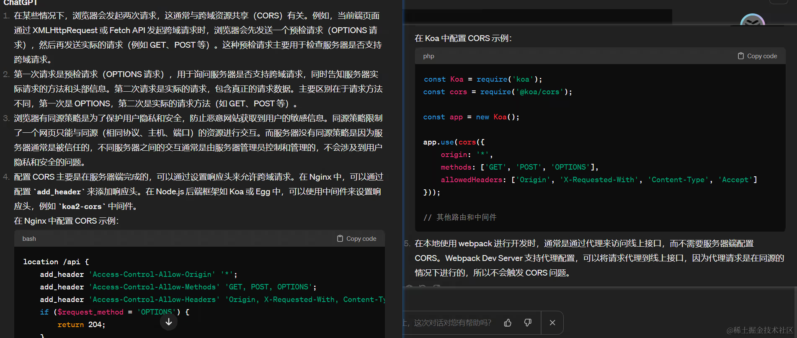
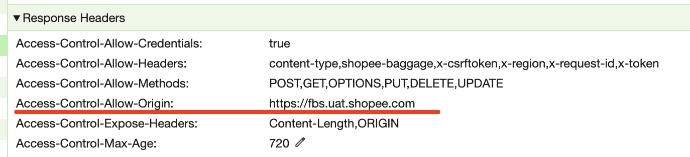

# CORS
### 问题
1、什么场景下会在一次请求里会发起两次请求；
2、第一次和第二次请求分别是什么，有什么区别？
3、为什么浏览器有同源策略，而服务器没有？
4、服务器如何配置cors。如果是nginx里如何配置，如果是nodejs后端，例如koa或者egg如何配置；
5、为什么本地使用webpack进行dev开发时，访问的是127.0.0.1，但是却依然能在不需要服务器端配置cors的情况下访问到线上接口？

如下表给出了与 URL http://store.company.com:80/dir/page.html 的源进行对比的示例：
| URL | 结果 | 原因|
| --- | --- |  --- |
| http://store.company.com:80/dir2/page.html |	同源	|只有路径不同
| http://store.company.com:443/dir2/page.html |	不同源	| 端口不同
| http://store.company.com:81/dir/etc.html |	不同源	| 端口不同
| https://store.company.com:80/dir/etc.html |	不同源	| 协议不同,HTTP和HTTPS
http://news.company.com:80/dir/other.html |	不同源|	主机不同

实际跨域

[彻底理解跨域](https://github.com/amandakelake/blog/issues/62)
